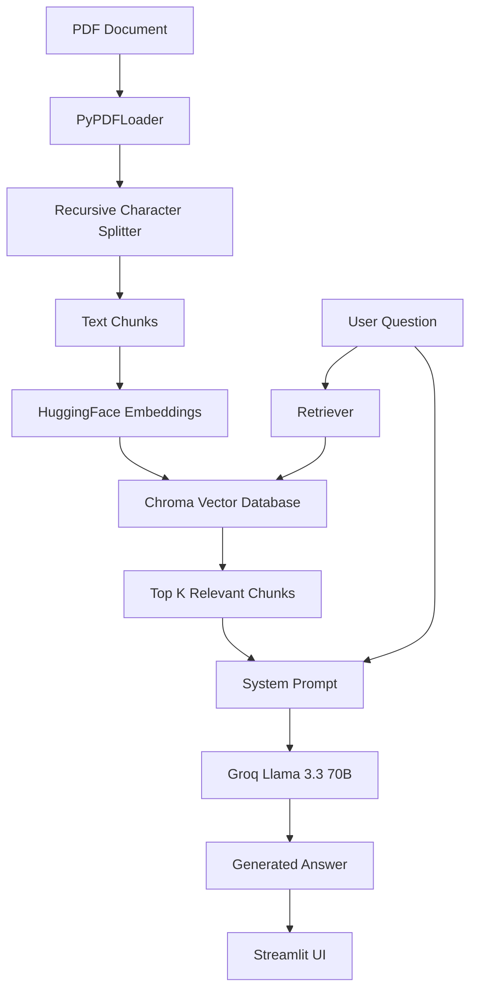

# 📚 FastAPI PDF RAG Chatbot

A simple Retrieval-Augmented Generation (RAG) application built using **Streamlit**, **LangChain**, **ChromaDB**, **HuggingFace Embeddings**, and **Groq Llama 3.3 70B**.

The application allows users to ask questions about a PDF document and receive answers grounded only in the document's content.

---

## 🚀 Features

* 📄 PDF document ingestion
* ✂️ Automatic text chunking
* 🧠 Semantic search using embeddings
* 🗄️ Chroma vector database
* 🤖 Groq Llama 3.3 70B integration
* 🔍 Context-aware question answering
* 📚 Retrieval-Augmented Generation (RAG)
* 🎨 Simple Streamlit UI

---

## 🏗️ Architecture

```text
PDF Document
      ↓
PyPDFLoader
      ↓
Text Chunking
      ↓
HuggingFace Embeddings
      ↓
Chroma Vector Store
      ↓
Retriever
      ↓
Relevant Context
      ↓
Groq Llama 3.3 70B
      ↓
Final Answer
      ↓
Streamlit UI
```

---

## 🧠 RAG Pipeline



---

## 🛠️ Tech Stack

| Layer           | Technology         |
| --------------- | ------------------ |
| UI              | Streamlit          |
| LLM             | Groq Llama 3.3 70B |
| Framework       | LangChain          |
| Vector Database | ChromaDB           |
| Embeddings      | all-MiniLM-L6-v2   |
| PDF Loader      | PyPDFLoader        |
| Language        | Python             |

---

## 📁 Project Structure

```text
pdf-rag-chatbot/
│
├── main.js
├── .env
├── requirements.txt
├── FastAPI_RAG_Test_Notes.pdf
│
└── vector_db/
```

---

## ⚙️ Installation

### Clone Repository

```bash
git clone https://github.com/yourusername/pdf-rag-chatbot.git

cd pdf-rag-chatbot
```

### Create Virtual Environment

```bash
python -m venv venv
```

### Activate Environment

Windows:

```bash
venv\Scripts\activate
```

Linux / Mac:

```bash
source venv/bin/activate
```

### Install Dependencies

```bash
pip install -r requirements.txt
```

---

## 🔑 Environment Variables

Create a `.env` file:

```env
GROQ_API_KEY=your_groq_api_key
```

---

## ▶️ Run Application

```bash
streamlit run app.py
```

Application runs on:

```text
http://localhost:8501
```

---

## 📚 How It Works

### Step 1 — Load PDF

```python
loader = PyPDFLoader("./FastAPI_RAG_Test_Notes.pdf")
documents = loader.load()
```

The PDF is loaded and converted into LangChain documents.

---

### Step 2 — Split Documents

```python
RecursiveCharacterTextSplitter(
    chunk_size=500,
    chunk_overlap=50
)
```

The document is divided into smaller chunks for better retrieval accuracy.

---

### Step 3 — Generate Embeddings

```python
HuggingFaceEmbeddings(
    model_name="all-MiniLM-L6-v2"
)
```

Each chunk is converted into a numerical vector representation.

---

### Step 4 — Store in ChromaDB

```python
Chroma.from_documents(...)
```

Embeddings are stored in a vector database for semantic search.

---

### Step 5 — Retrieve Relevant Chunks

```python
retriever.invoke(question)
```

Top matching chunks are retrieved based on semantic similarity.

---

### Step 6 — Generate Answer

```python
ChatGroq(
    model_name="llama-3.3-70b-versatile"
)
```

The retrieved context and user question are passed to the LLM.

---

## 🎯 Example

### User Question

```text
What is FastAPI?
```

### Retrieved Context

```text
FastAPI is a modern web framework for building APIs with Python.
```

### Model Response

```text
FastAPI is a modern Python framework used to build high-performance APIs.
```

---

## 🔮 Future Improvements

* Multi-PDF Support
* PDF Upload Feature
* Conversation Memory
* Source Citations
* Hybrid Search
* Reranking
* Streaming Responses
* Docker Deployment

---

## 👨‍💻 Author

Shivaji Jagdale

Learning GenAI, RAG Systems, LangChain, and AI Engineering.

---

⭐ If you found this project useful, consider giving it a star.
